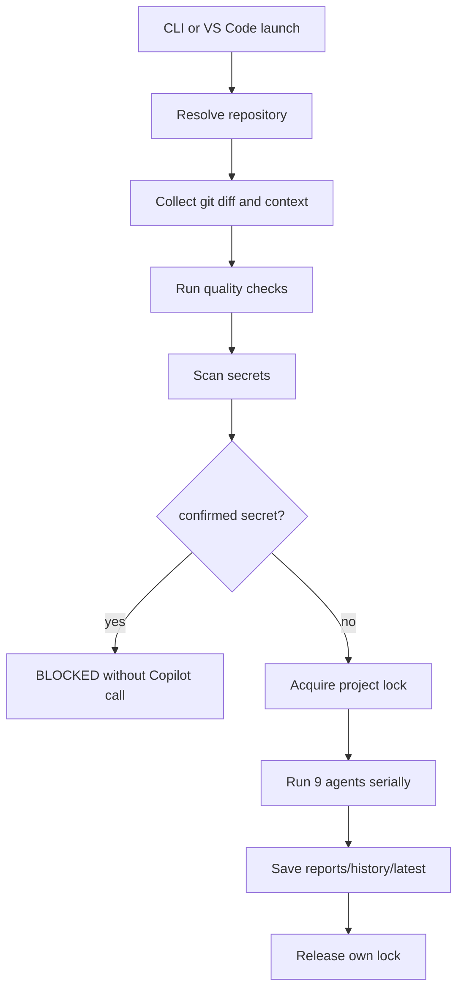

# Architecture

## Overview

copilot-multi-reviewは、レビュー対象リポジトリから分離された専用レビューエンジンです。

- engine root: このリポジトリ
- repository root: `--repo`で指定された外部Gitリポジトリ
- output root: `reports/`
- runtime root: `runtime/`

対象リポジトリへレビューコード、設定、runtime、レポートは作成しません。

## Flow

## Git handling

Repository resolution uses:

- `git rev-parse --show-toplevel`
- `git rev-parse --git-common-dir`
- `git config --get remote.origin.url`
- `git branch --show-current`
- `git rev-parse HEAD`

Base branch priority:

1. CLI `--base-branch`
2. `origin/HEAD`
3. `main`
4. `develop`

No automatic fetch is performed.

## Agents

The engine runs these agents in a plain `for` loop:

1. requirements
2. correctness
3. security
4. testing
5. maintainability
6. performance
7. operations
8. devil_advocate
9. final

The implementation does not use thread pools, parallel subprocesses, or `asyncio.gather`.

## Persistence

`run.json` stores repository metadata, target, request, diff size, quality check summaries, agent states, Copilot CLI version, run ID, and timestamps. It does not store complete prompts, unchecked diffs, or secret values.

Locks are acquired with exclusive file creation and released only when owner and generation match.

## Repository Audit

Repository audit is an additional mode and does not replace diff review targets. The existing `base`, `uncommitted`, `staged`, `commits`, and `file` targets keep their original behavior. The audit mode is invoked with `ai-review audit --repo <path>` or the compatibility form `ai-review review --repo <path> --target repository`.

File collection uses `git ls-files -z` so paths with spaces, Japanese text, tabs, quotes, and backslashes are handled as NUL-delimited entries. Untracked files are excluded by default and are considered only when `--include-untracked` is provided. Path traversal, repository-external symlink targets, binary files, oversized files, generated media, logs, and secret-like files are represented in coverage rather than silently ignored.

The audit planner builds stable `batch-001` style batches instead of sending the repository as one prompt. Batches consider top-level directory, language, implementation/test relationships, estimated lines, file count, and payload size. A single oversized file is split by safe line ranges when possible; otherwise it is recorded as skipped or unreviewed.

`AuditFile` represents the source file, while `AuditFileSegment` represents the exact range sent to Copilot. Segment payloads include `path`, `start_line`, `end_line`, `language`, and only the selected `content`; the same full file is not repeated across batches. The current splitter is line-range based, not syntax-aware. If one physical line exceeds the character limit, the file is marked `skipped` instead of being silently sent.

Profiles define the agent plan:

- `quick`: batch `correctness`, `security`; cross-repository `final`
- `standard`: batch `correctness`, `security`, `testing`, `maintainability`; cross-repository `requirements`, `performance`, `operations`, `devil_advocate`, `final`
- `deep`: batch specialist agents; cross-repository `final`

For `deep`, "specialist agents" means the eight non-final agents. `final` runs once in the cross-repository integration phase.

Execution remains strictly serial: batch by batch, then agent by agent, followed by cross-repository integration. The implementation does not use thread pools, multiprocessing for Copilot calls, parallel subprocesses, or `asyncio.gather`; tests assert `max_active_calls == 1`.

Confirmed secrets detected before sending any audit payload make the whole run `BLOCKED` and keep Copilot call count at `0`. Prompt text, unchecked file contents, and secret values are not persisted.

Tracked or explicitly included secret files such as `.env`, `.env.*`, `*.key`, `*.pem`, and `*.p12` are treated as confirmed secret files by default. Fixture, detector definition, and documentation sample contexts can be non-blocking, but real tokens and real PEM blocks remain blocking.

Audit output is stored under `reports/<project-id>/history/<run-id>/` and mirrored to `latest/`. `repository-summary.json` stores aggregate counts, `coverage.json` stores per-file status and reason, `batches/` stores batch plans, and `agents/` stores per-agent results. The target repository is never used as an output root.

Coverage has both file-level aggregation and segment-level details. File status is aggregated safely: `blocked`, `failed`, `cancelled`, `unreviewed`, and `skipped` take precedence over `reviewed`. Batch states are tracked separately as `pending`, `running`, `completed`, `failed`, `blocked`, `cancelled`, and `skipped`; cancelled batches are not counted as failed.

Copilot errors are sanitized and classified as `authentication`, `rate_limit`, `timeout`, `schema_validation`, `cancelled`, `process_start`, `network`, or `unexpected`. Stored error records include kind, agent, batch ID, safe message, retryability, and timestamp only.

Configuration precedence is CLI explicit value, rerun request value, `config/common.json`, then code fallback. `config/common.json` is the normal source of repository audit defaults.
