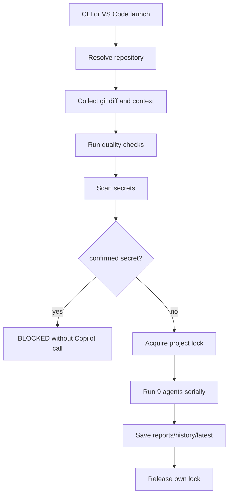

# Architecture

## Overview

copilot-multi-reviewは、レビュー対象リポジトリから分離された専用レビューエンジンです。

- engine root: このリポジトリ
- repository root: `--repo`で指定された外部Gitリポジトリ
- output root: `reports/`
- runtime root: `runtime/`

対象リポジトリへレビューコード、設定、runtime、レポートは作成しません。

## Flow

## Git handling

Repository resolution uses:

- `git rev-parse --show-toplevel`
- `git rev-parse --git-common-dir`
- `git config --get remote.origin.url`
- `git branch --show-current`
- `git rev-parse HEAD`

Base branch priority:

1. CLI `--base-branch`
2. `origin/HEAD`
3. `main`
4. `develop`

No automatic fetch is performed.

## Agents

The engine runs these agents in a plain `for` loop:

1. requirements
2. correctness
3. security
4. testing
5. maintainability
6. performance
7. operations
8. devil_advocate
9. final

The implementation does not use thread pools, parallel subprocesses, or `asyncio.gather`.

## Persistence

`run.json` stores repository metadata, target, request, diff size, quality check summaries, agent states, Copilot CLI version, run ID, and timestamps. It does not store complete prompts, unchecked diffs, or secret values.

Locks are acquired with exclusive file creation and released only when owner and generation match.
