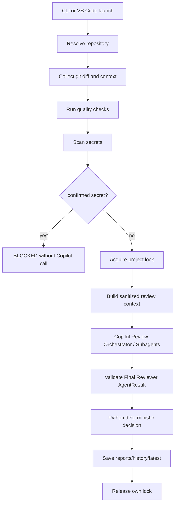
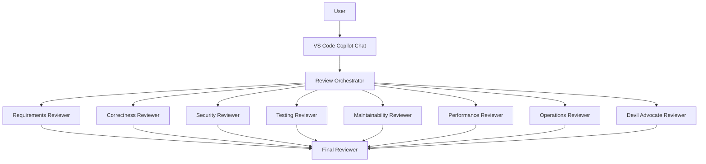
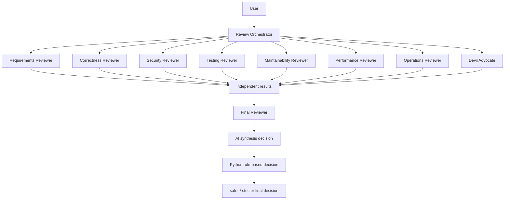
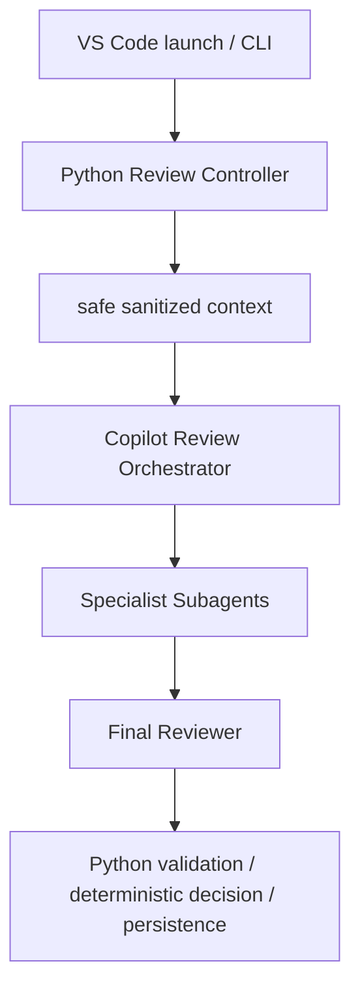

# Architecture

## Overview

copilot-multi-reviewは、レビュー対象リポジトリから分離された専用レビューエンジンです。

- engine root: このリポジトリ
- repository root: `--repo`で指定された外部Gitリポジトリ
- output root: `reports/`
- runtime root: `runtime/`

対象リポジトリへレビューコード、設定、runtime、レポートは作成しません。

## Flow



## Git handling

Repository resolution uses:

- `git rev-parse --show-toplevel`
- `git rev-parse --git-common-dir`
- `git config --get remote.origin.url`
- `git branch --show-current`
- `git rev-parse HEAD`

Base branch priority:

1. CLI `--base-branch`
2. `origin/HEAD`
3. `main`
4. `develop`

No automatic fetch is performed.

## Review Controller and Agents

The standard execution mode is `subagent`.

Python acts as the Review Controller:

1. resolve the repository and review target
2. collect diff and context
3. run quality checks
4. scan secrets before any Copilot invocation
5. enforce preflight blocking
6. manage run ID, runtime files, locks, cancellation, and timeouts where Python can control them
7. build sanitized review context
8. invoke the Copilot Review Orchestrator once
9. validate the untrusted Final Reviewer `AgentResult`
10. reconcile AI and rule-based decisions with the safer result
11. persist `reports/`, `history/`, and `latest`

Copilot Custom Agents perform review and synthesis:

- Review Orchestrator delegates only.
- The eight Specialist Reviewers analyze independently.
- Specialist Reviewers do not receive `previous_results`, `prior_findings`, `other_reviewer_results`, or equivalent cross-reviewer state.
- Only the Final Reviewer receives all specialist results and reviewer states.
- The Final Reviewer returns an AI-side decision candidate, not the final authority.

AI output is untrusted input. Python must validate it before decision or persistence.

Deprecated `legacy` mode keeps the old Python-driven serial runner temporarily:

1. requirements
2. correctness
3. security
4. testing
5. maintainability
6. performance
7. operations
8. devil_advocate
9. final

Legacy mode is not a co-equal standard implementation. It exists only for migration compatibility through `--execution-mode legacy`. Removal is allowed after downstream CLI users no longer need Python to invoke `agents/*.md`; the responsibilities removed will be specialist AI invocation, reviewer result handoff, and Python-side Final Reviewer invocation.

## Persistence

`run.json` stores repository metadata, target, request, diff size, quality check summaries, agent states, Copilot CLI version, run ID, and timestamps. It does not store complete prompts, unchecked diffs, or secret values.

Locks are acquired with exclusive file creation and released only when owner and generation match.

## Copilot Custom Agent Review Orchestration

Issue #27 makes the Copilot Custom Agent orchestration the standard AI review path. Python remains the deterministic safety boundary and persistence controller.

The Custom Agent path is for human-facing orchestration in Copilot Chat:



Final Reviewer synthesis and Python rule-based final decision are separate:



Only the Final Reviewer sees all specialist reviewer results. Specialist reviewers receive the same primary target context and must not receive other reviewers' findings, summaries, severities, or conclusions. The Final Reviewer receives specialist results, reviewer states, truncation status, scan/check status, and minimal target metadata for integration; it must not redo detailed specialist review from the original diff.

The current automated local review flow is:



### Python Review Controller Responsibilities

The Python side remains responsible for:

- git diff collection
- target repository resolution
- base/head resolution
- secret detection
- quality checks
- execution locks
- cancellation
- runtime management
- report and history persistence
- CLI commands
- VS Code launch integration
- Copilot CLI process startup for the orchestrator
- AgentResult schema validation
- fail-safe reconciliation
- safety constraints for local execution

The Python Review Controller is not a specialist reviewer. It prepares, validates, decides, and persists.

### Copilot Custom Agent Responsibilities

The Custom Agent side is responsible for:

- human-facing review entry through VS Code Copilot Chat
- Review Orchestrator behavior
- specialist reviewer selection
- delegation to reviewer subagents when those subagents exist
- collection and tracking of reviewer results
- delegation of final synthesis to the Final Reviewer when available
- explanation of agent execution state to the user

The Review Orchestrator must not perform detailed requirements, correctness, security, testing, maintainability, performance, operations, devil advocate, or final decision review itself. It coordinates specialist work and reports missing, failed, blocked, or inconclusive reviewer outcomes.

The Final Reviewer is a read-only leaf Custom Agent. It performs synthesis only:

- merge duplicate specialist findings without overcounting
- retain `reported_by`, `reported_severities`, and Critical/Major rationale provenance
- resolve severity conflicts conservatively with `Critical > Major > Minor > Info`
- surface contradictions between reviewers under `conflicts`
- surface failed, missing, skipped, not_run, blocked, and inconclusive reviewers
- avoid unconditional `APPROVE` when context is truncated, quality/secret checks are unreliable, or required reviewers are incomplete
- emit only the existing decision vocabulary: `APPROVE`, `APPROVE_WITH_NOTES`, `CHANGES_REQUIRED`, `BLOCKED`, `INCONCLUSIVE`

The Final Reviewer decision is an AI synthesis candidate. It is not the final pass/fail authority by itself. The Python ReviewEngine keeps its existing safety rule:

```python
ai_decision = ...
rules = rule_based_decision(...)
final_decision = stricter_decision(rules, ai_decision)
```

This preserves the safer decision when AI synthesis and rule-based decision disagree.

### Boundary Rules

The design forbids:

- deleting the Python ReviewEngine
- moving the entire CLI review flow into Custom Agents
- implementing duplicate git diff collection in both Python and Custom Agents
- implementing duplicate secret scanning in both Python and Custom Agents
- adding independent git mutation logic to the Orchestrator
- allowing the Orchestrator to commit, push, merge, reset, checkout, clean, rebase, or tag
- allowing automatic fixes or generated code application from the Orchestrator
- writing review result files into the target repository

Custom Agents may receive diff/context that was already collected by the user or Python tooling, but they must not hide truncation, secret scan failures, quality check failures, missing context, failed reviewers, or unrun reviewers.

### Custom Agent Validation

Custom Agent validation has two layers:

- Custom Agent schema validation checks whether `.agent.md` frontmatter is valid YAML and structurally usable by GitHub / VS Code Custom Agents.
- Review-only policy validation checks whether this repository's review agents satisfy the local safety requirements.

An omitted `tools` field is not a general GitHub / VS Code Custom Agent schema error. For `copilot-multi-review` review-only agents, however, `tools` must be explicitly declared so the validator can verify that editing and terminal capabilities are not enabled.

Issue #28 adds UX validation for Copilot Chat subagent visibility. `Review Orchestrator` remains user-selectable. Specialist reviewers and `Final Reviewer` use the officially documented `user-invocable: false` frontmatter field so they do not appear as normal picker entries while remaining available as subagents. They must not set `disable-model-invocation: true`, because that would block ordinary subagent invocation. The Orchestrator uses `tools: ['search/codebase', 'search/usages', 'web/fetch', 'agent']` and an explicit `agents:` list whose names must match the leaf agent `name` fields exactly.

Copilot Chat progress is not implemented by this repository. Users inspect the standard VS Code / GitHub Copilot subagent tool calls for running, completed, failed, prompt/context, tool usage, and result details. See `docs/copilot-chat-review-ux.md` for the operating procedure, product-version assumptions, manual Windows E2E record, and `run_id` notes.

### Specialist Reviewer Boundaries

Issue #25 adds eight read-only Custom Agent specialist reviewers. They are leaf subagents: the Review Orchestrator may invoke them, but they must not invoke other agents, edit files, run terminal commands, or write review artifacts into the target repository. Each reviewer receives the same primary diff/context and evaluates it independently. Specialist reviewers do not receive `previous_findings`; reviewer results are aggregated only after specialist execution and then passed to the Final Reviewer.

| Reviewer | Primary responsibility | Should report | Should defer to |
| --- | --- | --- | --- |
| `requirements` / `Requirements Reviewer` | Requirements, Issue text, acceptance criteria, user request, README and architecture alignment | Requirement gaps, acceptance criteria misses, scope drift, compatibility violations | implementation logic details, security mechanics, test quality |
| `correctness` / `Correctness Reviewer` | Implementation logic, data flow, state transitions, edge cases, error handling | Bugs, invalid states, broken error propagation, incorrect API use | requirement interpretation, security impact, test adequacy |
| `security` / `Security Reviewer` | Auth, authorization, secrets, command execution, injection, path traversal, unsafe subprocess and GitHub Actions risks | Secret leakage, unsafe command execution, permission flaws, unsafe git or repository mutation | general maintainability, pure correctness bugs, test coverage |
| `testing` / `Testing Reviewer` | Meaningful test coverage for changed behavior, abnormal paths, boundary cases, regressions, and mocks | Specific untested behavior and the failure it would miss | whether requirements are correct, whether implementation logic is defective |
| `maintainability` / `Maintainability Reviewer` | Responsibility boundaries, duplication, readability, naming, cohesion, coupling, extension cost | Issues that materially raise future change or understanding cost | pure requirements, security, correctness, performance, or operations findings |
| `performance` / `Performance Reviewer` | Meaningful runtime, I/O, memory, scaling, large-diff, repeated work, and subprocess cost | Concrete stability, latency, memory, or scalability risks | style preferences, ordinary maintainability, pure correctness |
| `operations` / `Operations Reviewer` | Runtime behavior, diagnostics, locks, cancellation, rerun, Windows/Linux differences, CLI UX, installation | Recovery, observability, lock cleanup, encoding, Copilot CLI detection, and configuration risks | implementation logic, security vulnerabilities, test coverage |
| `devil_advocate` / `Devil Advocate` | Independent challenge of assumptions, fail-open behavior, surprising user paths, migration and compatibility risks | Plausible hidden assumptions or feature interaction risks | critiquing other reviewers, final synthesis, detailed specialist findings |
